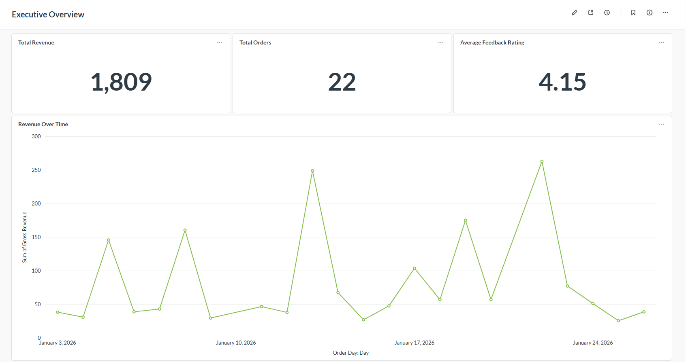
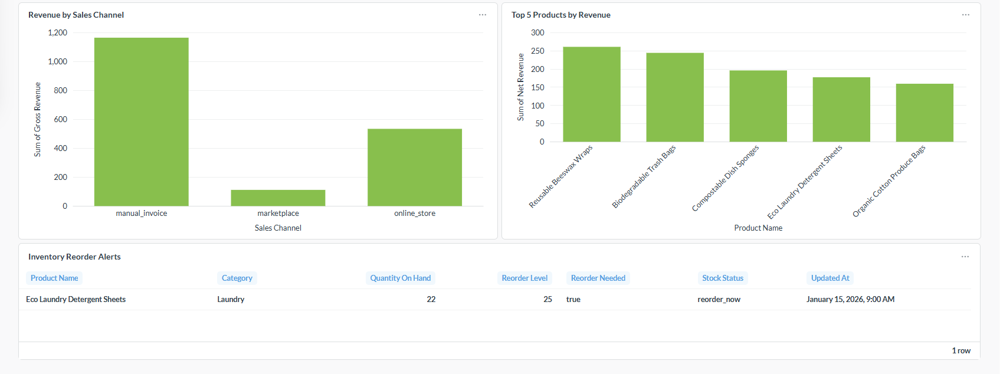
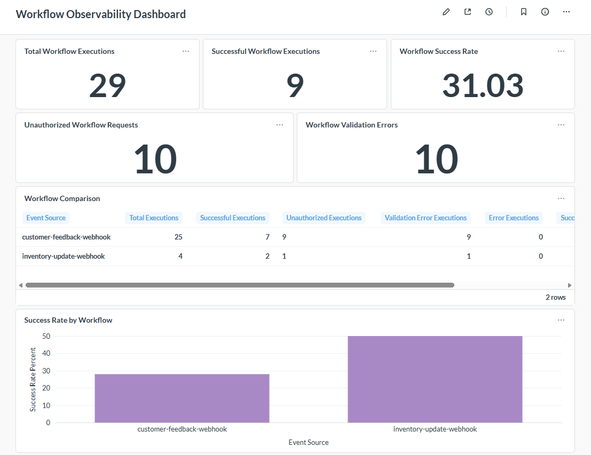
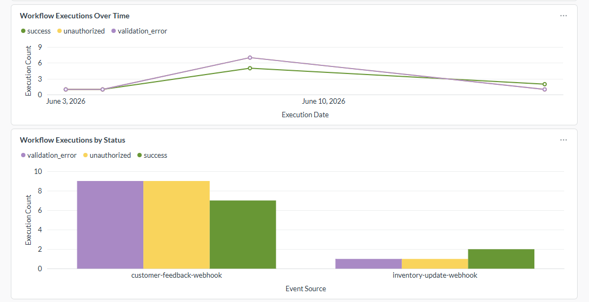
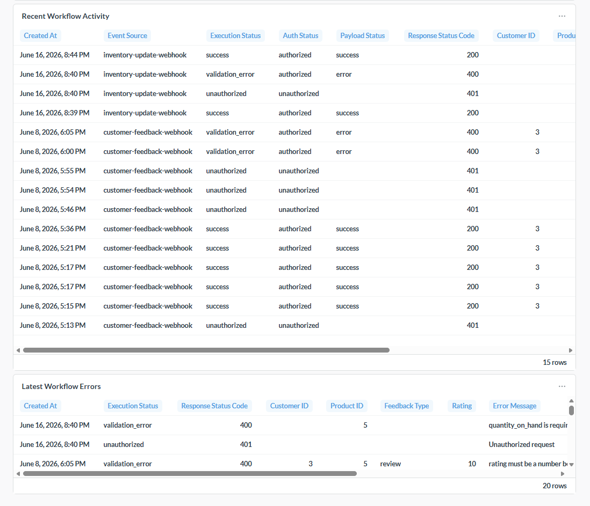
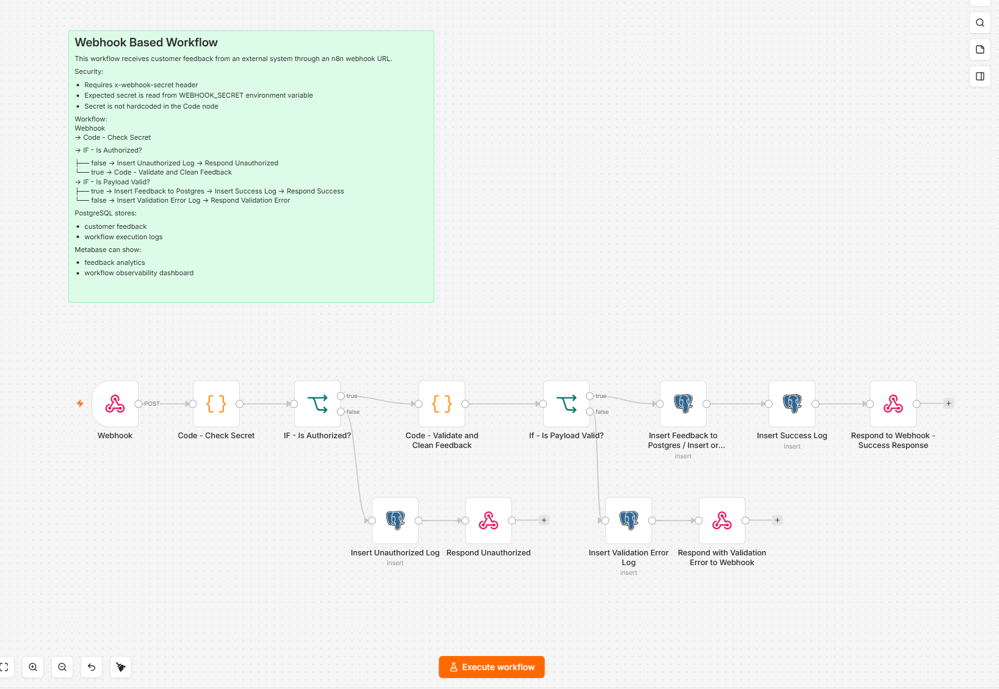
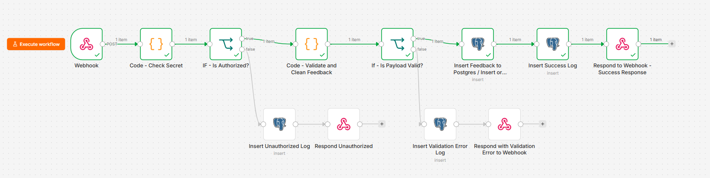
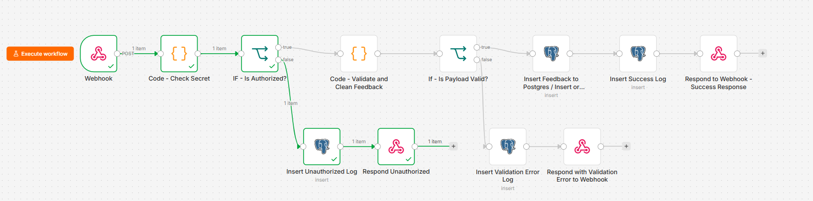
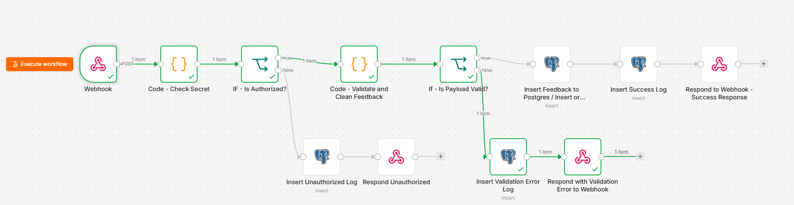

# Business Ops Intelligence Hub


## Portfolio Deployment Scope

This project is designed as a local Docker Compose portfolio deployment.

It is not presented as a production cloud deployment. The goal is to demonstrate a reproducible analytics and automation stack that can be cloned, configured with a local `.env` file, started locally, and reviewed through PostgreSQL, n8n, and Metabase.

---

## Project Summary

A self-hosted small-business analytics and automation platform for a fictional e-commerce business called **EcoHome Supplies**.

The project combines:

* PostgreSQL for structured business data and workflow logs
* n8n for webhook automation and data ingestion
* Metabase for business intelligence dashboards
* Docker Compose for local infrastructure
* Git/GitHub for version control and documentation

The goal is to show how a small business can collect operational data, clean it automatically, store it in a database, visualize it in dashboards, and later extend the system with vector search and an AI assistant.

---

## Project Overview

Small businesses often create useful operational data every day:

* orders
* customers
* products
* inventory
* competitor prices
* customer feedback
* leads
* product descriptions

Instead of keeping this data scattered across spreadsheets, CSV files, and manual tools, this project builds a local analytics and automation stack.

Current core flow:

```text
Source data
→ PostgreSQL
→ SQL analytics views
→ Metabase dashboards
→ business decisions
```

Current automation flows:

```text
External customer feedback JSON
→ n8n webhook
→ security header check
→ payload validation
→ PostgreSQL insert
→ workflow execution log
→ Metabase observability dashboard

External inventory update JSON
→ n8n webhook
→ security header check
→ payload validation
→ PostgreSQL inventory update
→ workflow execution log
→ Metabase observability dashboard
```

Future extension:

```text
Documents / feedback / product text
→ vector database
→ AI assistant
→ searchable business context
```

---

## Architecture

```text
External request / business data
        |
        v
      n8n
  webhook automation
        |
        v
   PostgreSQL
business data + workflow logs
        |
        v
    SQL views
analytics-ready layer
        |
        v
    Metabase
dashboards and monitoring
```

The project currently proves that a local Docker-based stack can support business intelligence, multiple n8n business automations, and automation observability.

---

## Tech Stack

| Layer           | Tool                           | Purpose                                                                                     |
| --------------- | ------------------------------ | ------------------------------------------------------------------------------------------- |
| Database        | PostgreSQL                     | Stores business data, customer feedback, and workflow logs                                  |
| Automation      | n8n                            | Receives webhook data, validates it, inserts it into PostgreSQL, and logs workflow activity |
| BI / Dashboards | Metabase                       | Visualizes business KPIs and workflow observability                                         |
| Infrastructure  | Docker Compose                 | Runs PostgreSQL, n8n, and Metabase locally                                                  |
| Version Control | Git/GitHub                     | Tracks SQL, documentation, and exported workflow JSON                                       |
| Future AI Layer | Vector database + AI assistant | Planned document and business-context search                                                |

---

## Current Workflows

The current n8n automation layer contains two business workflows:

1. Customer feedback webhook workflow
2. Inventory update webhook workflow

Both workflows use the same reusable automation pattern:

```text
Webhook
→ Code - Check Secret
→ IF - Is Authorized?
    ├── false → Insert Unauthorized Log → Respond Unauthorized
    └── true  → Code - Validate and Clean Payload
                → IF - Is Payload Valid?
                    ├── true → PostgreSQL insert or update
                    │           → Insert Success Log
                    │           → Respond Success
                    └── false → Insert Validation Error Log
                                → Respond Validation Error
```

The customer feedback workflow inserts valid customer feedback into PostgreSQL.

The inventory update workflow updates an existing product inventory record in PostgreSQL.

Workflow log identifiers are standardized as stable technical names:

```text
workflow_name values:
customer_feedback_webhook
inventory_update_webhook

event_source values:
customer-feedback-webhook
inventory-update-webhook
```

`event_source` remains the preferred dashboard grouping field for workflow comparison.

Both workflows support three important execution paths:

```text
Unauthorized request
→ HTTP 401
→ workflow_execution_logs row

Authorized but invalid payload
→ HTTP 400
→ workflow_execution_logs row

Authorized and valid payload
→ PostgreSQL insert or update
→ workflow_execution_logs row
→ HTTP 200
```

---

## Repository Structure

```text
.
├── ai_assistant/
├── data/
│   ├── processed/
│   └── raw/
├── db/
│   ├── init/
│   │   ├── 00_create_databases.sql
│   │   ├── 01_create_business_schema.sql
│   │   ├── 02_seed_sample_data.sql
│   │   ├── 03_create_analytics_views.sql
│   │   ├── 04_create_workflow_logs.sql
│   │   └── 05_create_workflow_observability_views.sql
│   ├── queries/
│   └── views/
├── docs/
│   ├── architecture/
│   ├── metabase/
│   ├── n8n/
│   ├── screenshots/
│   └── security/
├── metabase/
├── n8n/
│   └── workflows/
│       ├── customer_feedback_webhook_workflow.json
│       └── inventory_update_webhook_workflow.json
├── scripts/
├── vector/
├── docker-compose.yml
├── .env.example
└── README.md
```

---

## Environment Configuration

The project uses a local `.env` file for real local configuration values.

The `.env` file should not be committed to Git.

The committed `.env.example` file contains safe placeholders only.

Use this command to create suitable .env

```bash
cp .env.example .env

```
Then,

```text
Edit `.env` and replace placeholder values before starting the stack.
```

Example webhook secret placeholder:

```env
WEBHOOK_SECRET=change_this_webhook_secret
```

The real local `.env` file should contain the actual local value:

```env
WEBHOOK_SECRET=your_local_webhook_secret
```

The n8n service receives this value through `docker-compose.yml`:

```yaml
WEBHOOK_SECRET: ${WEBHOOK_SECRET}
N8N_BLOCK_ENV_ACCESS_IN_NODE: "false"
```

Inside the n8n Code node, the workflow reads the secret with:

```javascript
const expectedSecret = $env.WEBHOOK_SECRET;
```

Important n8n note:

```text
process.env.WEBHOOK_SECRET does not work inside this n8n Code node.
The working pattern is $env.WEBHOOK_SECRET.
```

---

## How to Run the Stack

From the project root:

```bash
docker compose up -d
```

Check running containers:

```bash
docker ps
```

Expected local services:

```text
PostgreSQL: http://localhost:5432
n8n:        http://localhost:5678
Metabase:   http://localhost:3000
```

The ports are bound to `127.0.0.1`, so the services are intended for local development access.

---

## PostgreSQL Database Layer

PostgreSQL stores the main business data and workflow execution logs.

PostgreSQL initialization files in `db/init` run automatically only when the Postgres Docker volume is first created. If the database volume already exists, changes to files in `db/init` are not automatically reapplied.

Important SQL files:

```text
db/init/01_create_business_schema.sql
db/init/02_seed_sample_data.sql
db/init/03_create_analytics_views.sql
db/init/04_create_workflow_logs.sql
db/init/05_create_workflow_observability_views.sql
```

The business database includes sample data for:

```text
customers
products
orders
order_items
inventory
customer_feedback
competitor_prices
workflow_execution_logs
```

The SQL views prepare dashboard-ready data for Metabase.

---

## n8n Automation Layer

n8n is used to automate customer feedback ingestion and inventory updates.

The workflows receive external JSON, check a secret header, validate the payload, write to PostgreSQL, log each important execution path, and return clear HTTP responses.

Current production webhook paths:

```text
/webhook/customer-feedback
/webhook/inventory-update
```

Current test webhook paths:

```text
/webhook-test/customer-feedback
/webhook-test/inventory-update
```

Important distinction:

```text
/webhook-test/...  = used while testing inside n8n
/webhook/...       = production URL, works when the workflow is active/published
```

---

## Metabase Analytics Layer

Metabase is used as the dashboard and business intelligence layer.

Current dashboards:

```text
Executive Overview
Workflow Observability Dashboard
```

The Executive Overview dashboard shows business KPIs such as revenue, orders, feedback rating, product performance, sales channel performance, and inventory alerts.

The Workflow Observability Dashboard shows n8n workflow activity across multiple automations, including successful executions, unauthorized requests, validation errors, success rate, workflow comparison, execution trends, and recent workflow errors.

---

## Screenshots

### Executive Overview Dashboard

The Executive Overview dashboard shows business KPIs, revenue trends, sales-channel performance, top products, and inventory reorder alerts.






### Workflow Observability Dashboard


The Workflow Observability Dashboard shows n8n webhook execution activity across multiple automations, including successful executions, unauthorized requests, validation errors, success rate, workflow comparison, execution trends, and recent workflow errors.








### n8n Customer Feedback Workflow

The n8n workflow receives customer feedback through a webhook, checks the shared secret, validates the payload, inserts valid feedback into PostgreSQL, and logs each important execution path.



### n8n Workflow Execution Paths

Successful customer feedback ingestion:



Unauthorized request path:



Validation-error path:




## Exported n8n Workflows

The current n8n workflows are exported and version-controlled here:

```text
n8n/workflows/customer_feedback_webhook_workflow.json
n8n/workflows/inventory_update_webhook_workflow.json
```

This means the workflows are no longer only stored inside the n8n UI.

The exported JSON helps with:

```text
workflow backup
workflow review
workflow restore
version control
portfolio documentation
secret-safety checks
```

The exported workflows may still require local n8n credentials to be reconnected after import into a fresh n8n instance.

---

## How to Restore the n8n Workflows

To restore or reuse the exported workflows:

```text
1. Start the Docker stack.
2. Open n8n at http://localhost:5678.
3. Import the required workflow JSON file:
   - n8n/workflows/customer_feedback_webhook_workflow.json
   - n8n/workflows/inventory_update_webhook_workflow.json
4. Review the imported nodes and connections.
5. Reconnect or confirm the PostgreSQL credential.
6. Confirm WEBHOOK_SECRET exists in the n8n container environment.
7. Test the unauthorized request path.
8. Test the authorized invalid payload path.
9. Test the authorized valid payload path.
10. Publish or activate the workflow before using the production webhook URL.
```

Check that the webhook secret exists inside the n8n container:

```bash
docker exec business_ops_n8n printenv WEBHOOK_SECRET
```

Expected local development result:

```text
your_local_webhook_secret
```

A fresh n8n import may preserve workflow structure and node settings, but credentials may need to be reconnected manually.

---

## Secret-Safety Checks

Before committing exported n8n workflow JSON, run these checks:

### Automated Workflow Secret-Check

```bash
bash scripts/check_workflow_secrets.sh
```

Or, if the script is executable:

```bash
./scripts/check_workflow_secrets.sh
```

Run this check after exporting or updating any n8n workflow JSON.

The script checks that:

```text
n8n/workflows exists
local-dev-secret is not present in exported workflow files
POSTGRES_ADMIN_PASSWORD is not present in exported workflow files
POSTGRES_ADMIN_USER is not present in exported workflow files
WEBHOOK_SECRET is referenced through the expected environment-variable pattern or safe documentation text
```

The exported workflow should reference:

```javascript
$env.WEBHOOK_SECRET
```

It should not contain the real local secret value.

### Manual Fallback Secret-Check (in case script is not working)

```bash
grep -R "local-dev-secret" -n n8n/workflows
grep -R "POSTGRES_ADMIN_PASSWORD" -n n8n/workflows
grep -R "POSTGRES_ADMIN_USER" -n n8n/workflows
grep -R "WEBHOOK_SECRET" -n n8n/workflows
```

Expected results:

```text
local-dev-secret         → no output
POSTGRES_ADMIN_PASSWORD  → no output
POSTGRES_ADMIN_USER      → no output
WEBHOOK_SECRET           → should appear only as an environment variable reference or safe documentation text
```

The exported workflow should reference:

```javascript
$env.WEBHOOK_SECRET
```

It should not contain the real local secret value.

Also check Git status before committing:

```bash
git status -sb
```

The real `.env` file should not appear as a staged or tracked file.

Only `.env.example` should be committed.

---


## Documentation Index

### n8n documentation

```text
docs/n8n/inventory_update_workflow.md
docs/n8n/customer_feedback_workflow.md
docs/n8n/webhook_customer_feedback_ingestion.md
docs/n8n/webhook_security_and_production_activation.md
docs/n8n/workflow_execution_logging.md
docs/n8n/production_readiness_improvements.md
docs/n8n/workflow_export_and_version_control.md
```

### Metabase documentation

```text
docs/metabase/executive_overview_dashboard.md
docs/metabase/workflow_observability_dashboard.md
```

### Key workflow export

```text
n8n/workflows/customer_feedback_webhook_workflow.json
n8n/workflows/inventory_update_webhook_workflow.json
```

---

## Current Project Status

Completed project steps:

```text
Step 2  — Docker Compose infrastructure
Step 3  — Business database schema
Step 4  — Seed sample business data
Step 5  — SQL analytics views
Step 6  — Metabase dashboard layer
Step 7  — n8n workflow foundation
Step 8  — Webhook-based n8n ingestion workflow
Step 9  — Webhook security header and production activation
Step 10 — Add n8n workflow execution logging to PostgreSQL
Step 11 — Build workflow observability analytics and Metabase dashboard
Step 12 — Production readiness improvements for n8n webhook workflow
Step 13 — Export and version-control the n8n workflow JSON
Step 14 — Project README with restore and secret-safety documentation
Step 15 — Add automated exported-workflow secret checks
Step 16 — Add n8n workflow exports README
Step 17 — Add dashboard screenshots and documentation polish
Step 18 — Add inventory update workflow automation
Step 19 — Extend workflow observability for multiple workflows
Step 20 — Standardize workflow_name values across workflow log nodes
```

The project currently demonstrates a working local BI and automation platform with:

```text
PostgreSQL business database
SQL analytics views
Metabase executive dashboard
n8n customer feedback webhook ingestion
n8n inventory update webhook automation
header-based webhook security
environment-based secret configuration
PostgreSQL workflow execution logging
Metabase workflow observability dashboard
exported n8n workflow JSON
automated workflow secret-safety checks
dashboard and workflow screenshots
portfolio-ready documentation
```

---

## Future Improvements

Possible next improvements:

```text
1. Add another business automation, such as competitor price updates or lead capture.
2. Track n8n execution IDs in workflow_execution_logs.
3. Track workflow execution duration.
4. Add alerting for repeated unauthorized requests.
5. Add alerting for repeated validation errors.
6. Add vector database support.
7. Add an AI assistant layer for document and business-context search.
8. Add optional production hardening such as request signing, replay protection, or rate limiting if the webhook is exposed publicly.
```

The current webhook security uses an environment-based shared secret and is suitable for local development and portfolio demonstration. Stronger request-signing controls are intentionally left as future production hardening rather than part of the current implementation.
